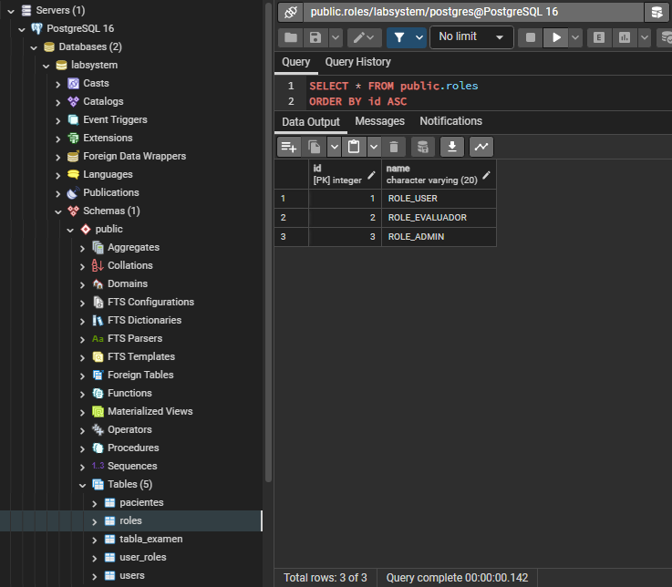
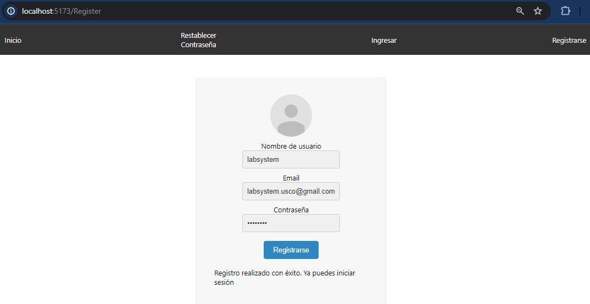

# labsystem

## Setup

1. Clone the repository:

  ```bash
  git clone https://github.com/nicolasrrdev/labsystem.git
  ```
  ```bash
  cd labsystem
  ```

2. Navigate to the Spring Boot project:

  ```bash
  cd labsystem-spring-boot
  ```

3. Create the `application.properties` file in the `resources` package (/src/main/resources/) and fill it in according to `application.properties.template`.

4. Create a db called `labsystem` in pgAdmin 4. Make sure you have Java 21 installed, then run the Spring Boot project:

  ```bash
  mvn spring-boot:run
  ```

5. Execute the next Query while in the `labsystem` db: 

  ```bash
  INSERT INTO roles(name) VALUES('ROLE_USER'),('ROLE_EVALUADOR'),('ROLE_ADMIN');
  ```

<div align="center">
  
</div> <br />

6. Using Node 21, navigate to the React app directory and install the Node Modules:

  ```bash
  cd ..
  ```
  ```bash
  cd labsystem-reactjs
  ```
  ```bash
  npm i
  ```

7. Create the `.env` file and fill it in according to `.env.template`.

8. Run the React app:

  ```bash
  npm run dev
  ```

9. Register a new user in the React app, then execute the next Query while in the `labsystem` db to establish an admin:

  ```bash
  UPDATE user_roles SET role_id = 3 WHERE user_id = 1;
  ```

<div align="center">
  
</div>
